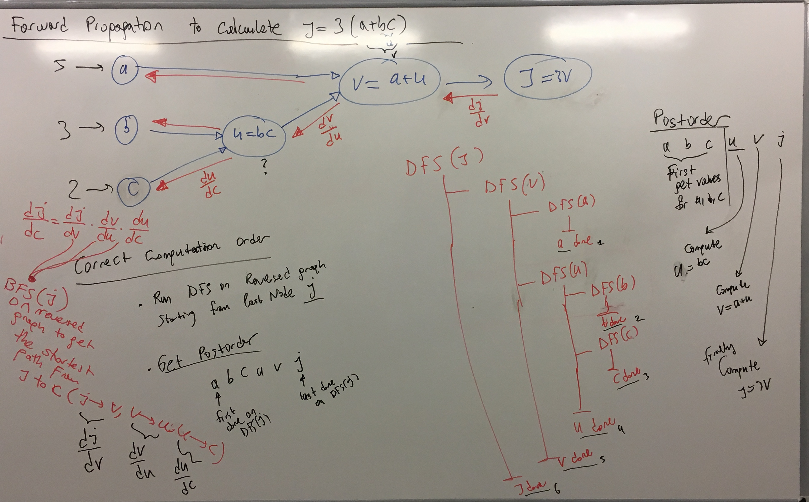
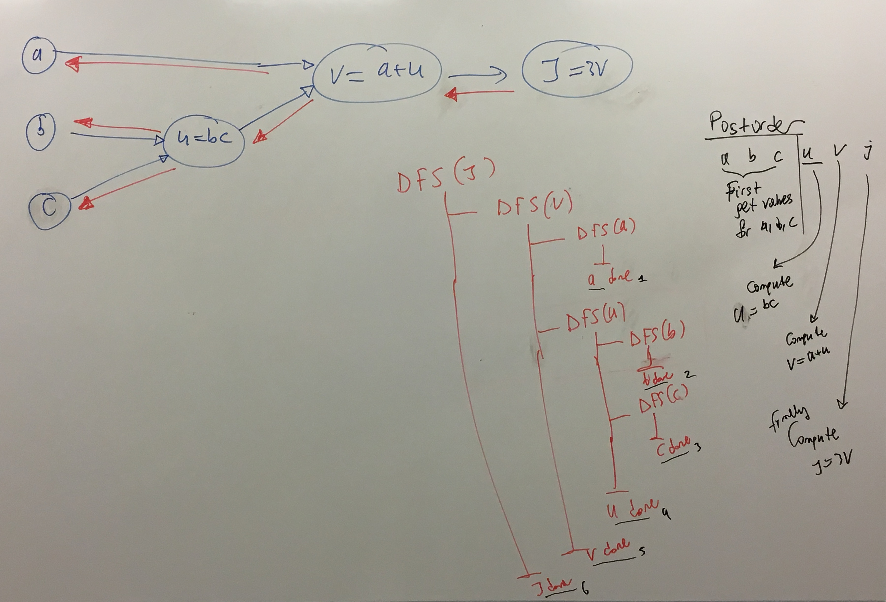
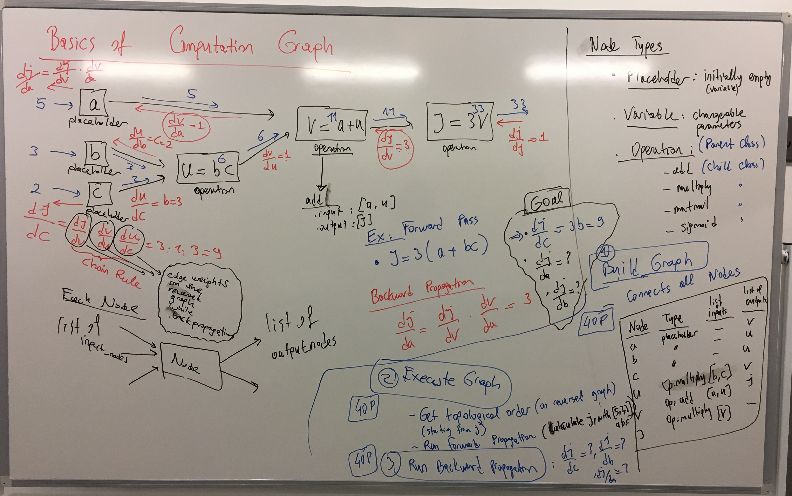
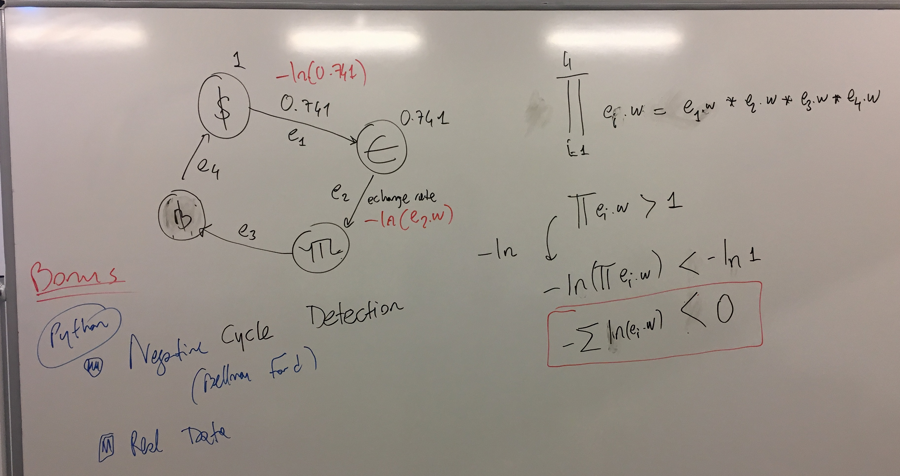

# Project Groups
Indicate your project groups on [google document link](https://docs.google.com/spreadsheets/d/1eA8juAoMCszqZNhIjR1ZPLR2L6qhRe1TfTPpugRA574/edit?usp=sharing)

# Time

|  Date |  Program | 
|---|---|
|  9 April |   |
|  16 April|   |
|  23 April |  Holiday |
|  30 April|   |
|  7 May|  [Project Presentation](https://github.com/uzay00/CMPE232/tree/master/2019/Project)|
|  14 May|  Review |

 # Project

Project: Basics of Computatation Graphs
 - [Understand TensorFlow by mimicking its API from scratch](https://medium.com/@d3lm/understand-tensorflow-by-mimicking-its-api-from-scratch-faa55787170d)

 - [Deep Learning From Scratch I: Computational Graphs](http://www.deepideas.net/deep-learning-from-scratch-i-computational-graphs/)
 
 

 
 
 
 
 # Bonus HW
 
